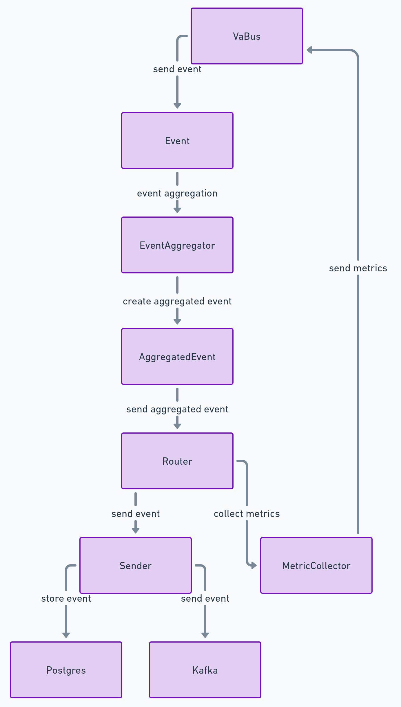

# VaBus Data Handler

## Description

VaBus Data Handler is designed to fetch events from the VaBus data bus, aggregate them based on specified functions and time intervals, and send the aggregated events to an external storage system, either Kafka or PostgreSQL. Additionally, the service collects and sends its own metrics to the VaBus for monitoring purposes.

## Features

- Fetch events from VaBus.
- Aggregate events by name, function (specified in the event), and time interval (specified in the service environment variables).
- Send aggregated events to external storage (Kafka or PostgreSQL) based on environment configuration.
- Collect and send service metrics to VaBus for monitoring.

## Installation

1. Clone the repository:

    ```bash
    git clone git@github.com:LastTherapy/sibur.git
    cd sibur
    ```

2. Install dependencies using Poetry:

    ```bash
    poetry install
    ```

## Usage

1. Set up the necessary environment variables:

    ```bash
    export STORAGE_TYPE="kafka" # or "postgres"
    export KAFKA_BOOTSTRAP_SERVERS="your_kafka_bootstrap_servers"
    export KAFKA_TOPIC="your_kafka_topic"
    export POSTGRES_CONNECTION_STRING="your_postgres_connection_string"
    export AGGREGATION_INTERVAL="60" # Aggregation interval in seconds
    export VABUS_URL="your_vabus_url"
    export DEFAULT_VABUS_URL="http://localhost:8000"
    ```

2. Run the service:

    ```bash
    poetry run python main.py
    ```

## Configuration

The service can be configured using the following environment variables:

- `STORAGE_TYPE`: Specifies the storage type for aggregated events (`kafka` or `postgres`).
- `KAFKA_BOOTSTRAP_SERVERS`: Comma-separated list of Kafka bootstrap servers.
- `KAFKA_TOPIC`: Kafka topic for sending aggregated events.
- `POSTGRES_CONNECTION_STRING`: PostgreSQL connection string.
- `AGGREGATION_INTERVAL`: Time interval (in seconds) for aggregating events.
- `VABUS_URL`: URL of the VaBus data bus.
- `DEFAULT_VABUS_URL`: Default URL for VaBus if `VABUS_URL` is not specified.

## Metrics

The service collects and sends the following metrics (for example) to VaBus:

- `aggregated_events_count`: Number of aggregated events sent to storage.
- `failed_events_count`: Number of events that failed to be processed.
- `processing_time`: Time taken to process and aggregate events.

## Using Docker

To build and run the Event Aggregator Service using Docker, follow these steps:

1. **Build the Docker image**:

    ```bash
    docker build -t vabus-data-handler .
    ```

2. **Run the Docker container**:

    ```bash
    docker run -d --name vabus_data_handler \
      -e STORAGE_TYPE="kafka" \
      -e KAFKA_BOOTSTRAP_SERVERS="your_kafka_bootstrap_servers" \
      -e KAFKA_TOPIC="your_kafka_topic" \
      -e POSTGRES_CONNECTION_STRING="your_postgres_connection_string" \
      -e AGGREGATION_INTERVAL="60" \
      -e VABUS_URL="your_vabus_url" \
      vabus-data-handler
    ```

This command runs the container in the background with the necessary environment variables.

## Project Structure

This project is organized into several key components that work together to handle data events from the VaBus data bus, aggregate them, and send them to either a Kafka topic or a PostgreSQL database. Additionally, the project collects metrics and sends them back to the VaBus data bus for monitoring purposes.

Components
### VaBus

Purpose: Acts as the data bus for sending and receiving events.
Interaction: Sends instances of the Event class.
Event

Purpose: Represents the individual data events received from the VaBus.
Attributes: Contains information relevant to the event data being processed.
### EventAggregator

Purpose: Aggregates multiple Event instances into fewer AggregatedEvent instances.
Interaction: Receives Event instances from VaBus, processes and reduces them, and then sends AggregatedEvent instances to the Router.
### AggregatedEvent

Purpose: Represents aggregated data events.
Attributes: Contains aggregated information from multiple Event instances.
### Router

Purpose: Routes AggregatedEvent instances to the appropriate storage (Kafka or PostgreSQL) using the Sender class.
Interaction: Receives AggregatedEvent instances from EventAggregator and uses Sender to forward them to the desired storage.
Additional Function: Collects metrics using the MetricCollector.
Sender

Purpose: Sends AggregatedEvent instances to either Kafka or PostgreSQL.
Implementation: Has specific implementations for sending data to Kafka (KafkaSender) and PostgreSQL (PostgresSender).
### MetricCollector

Purpose: Collects and manages metrics for monitoring purposes.
Interaction: Collects metrics throughout the event processing pipeline and sends them back to VaBus for monitoring.
Workflow
Event Reception: VaBus sends Event instances.
Event Aggregation: EventAggregator aggregates these events into AggregatedEvent instances.
Event Routing: Router receives AggregatedEvent instances and determines the storage destination based on configuration.
Data Sending: Sender sends the data to either Kafka or PostgreSQL.
Metric Collection: Throughout the process, MetricCollector gathers metrics, which are then sent back to VaBus for monitoring.

## Workflow



- Event Reception: VaBus sends Event instances.
- Event Aggregation: EventAggregator aggregates these events into AggregatedEvent instances.
- Event Routing: Router receives AggregatedEvent instances and determines the storage destination based on configuration.
- Data Sending: Sender sends the data to either Kafka or PostgreSQL.
- Metric Collection: Throughout the process, MetricCollector gathers metrics, which are then sent back to VaBus for monitoring.

## Potential Issues in the Service

### Data Loss

Problem: Data might be lost during transmission from VaBus to Kafka or PostgreSQL.
Solution: Implement retry mechanisms and acknowledgment confirmations to ensure data is successfully received and processed. Use distributed tracing to monitor data flow and quickly identify where data might be getting lost.

### Scalability

Problem: The service might not handle high volumes of incoming events effectively, leading to performance bottlenecks.
Solution: Use horizontal scaling by deploying multiple instances of the service and load balancing the incoming data. Implement asynchronous processing and use message partitioning to distribute the load evenly across multiple consumers.

### Latency

Problem: High latency in processing events and sending aggregated data can affect the performance of dependent systems.
Solution: Optimize the aggregation and sending logic for performance. Use in-memory data stores like Redis for faster aggregation operations and implement efficient indexing in PostgreSQL to speed up data writes.

### Fault Tolerance

Problem: The service might fail if Kafka or PostgreSQL instances are down.
Solution: Implement circuit breakers and fallback mechanisms. Use a robust orchestration tool like Kubernetes to ensure high availability and auto-restart failed services. Employ multi-region deployments for disaster recovery.

### Data Consistency

Problem: Ensuring data consistency between VaBus, Kafka, and PostgreSQL can be challenging.
Solution: Use distributed transactions where applicable and implement eventual consistency patterns. Employ idempotency in event handling to avoid duplicate processing.

### Security

Problem: The service might be vulnerable to unauthorized access or data breaches.
Solution: Implement strong authentication and authorization mechanisms. Use encrypted communication channels (TLS) and encrypt sensitive data both in transit and at rest. Regularly update dependencies to mitigate vulnerabilities.

## Potential Solutions to Problems

### Monitoring and Alerts

Implement comprehensive monitoring using tools like Prometheus and Grafana to keep track of system performance and health.
Set up alerts for critical metrics like processing time, error rates, and system load to ensure quick response to issues.

### Continuous Integration/Continuous Deployment (CI/CD)

Use CI/CD pipelines to automate testing and deployment, ensuring that changes are thoroughly tested and quickly deployed.
Implement rolling updates and blue-green deployments to minimize downtime during updates.

### Load Testing

Regularly perform load testing to identify performance bottlenecks and ensure the system can handle expected loads.
Use tools like Apache JMeter or Locust for load testing.

### Documentation and Best Practices

Maintain up-to-date documentation for all components and processes.
Follow best practices for coding, security, and infrastructure management.

## Potential Development Paths

### Enhanced Analytics

Develop advanced analytics features to provide deeper insights into event data and system performance.
Use machine learning models to predict trends and anomalies in event data.

### Integration with More Data Sources

Extend the service to integrate with additional data sources like NoSQL databases, cloud storage, or other message brokers.
Develop connectors for seamless integration with various external systems.

### Improved User Interface

Create a user-friendly interface for monitoring and managing the service.
Provide visualization tools for better understanding of metrics and data flow.

### Real-time Processing

Implement real-time processing capabilities to handle streaming data more efficiently.
Use technologies like Apache Flink or Apache Storm for real-time data processing.

### Serverless Architecture

Explore the use of serverless functions to handle event processing, which can simplify scaling and reduce operational overhead.
Use platforms like AWS Lambda or Google Cloud Functions.

### Advanced Security Features

Implement advanced security features like role-based access control (RBAC), multi-factor authentication (MFA), and anomaly detection.
Conduct regular security audits and penetration testing.
By addressing these potential issues and exploring these development paths, the service can be made more robust, scalable, and feature-rich, ensuring it meets the evolving needs of its users and stakeholders.
