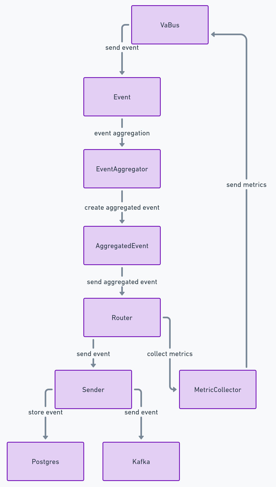

# VaBus Data Handler

## Описание

VaBus Data Handler предназначен для получения событий из шины данных VaBus, их агрегации на основе заданных функций и временных интервалов, а также отправки агрегированных событий в внешнюю систему хранения, будь то Kafka или PostgreSQL. Кроме того, сервис собирает и отправляет свои собственные метрики в VaBus для мониторинга.

## Функциональные возможности

- Получение событий из VaBus.
- Агрегация событий по имени, функции (указанной в событии) и временному интервалу (указанному в переменных окружения сервиса).
- Отправка агрегированных событий в внешнюю систему хранения (Kafka или PostgreSQL) в зависимости от конфигурации окружения.
- Сбор и отправка метрик сервиса в VaBus для мониторинга.

## Установка

1. Клонируйте репозиторий:

    ```bash
    git clone git@github.com:LastTherapy/sibur.git
    cd sibur
    ```

2. Установите зависимости с помощью Poetry:

    ```bash
    poetry install
    ```

## Использование

1. Настройте необходимые переменные окружения:

    ```bash
    export STORAGE_TYPE="kafka" # или "postgres"
    export KAFKA_BOOTSTRAP_SERVERS="your_kafka_bootstrap_servers"
    export KAFKA_TOPIC="your_kafka_topic"
    export POSTGRES_CONNECTION_STRING="your_postgres_connection_string"
    export AGGREGATION_INTERVAL="60" # Интервал агрегации в секундах
    export VABUS_URL="your_vabus_url"
    export DEFAULT_VABUS_URL="http://localhost:8000"
    ```

2. Запустите сервис:

    ```bash
    poetry run python main.py
    ```

## Конфигурация

Сервис можно настроить с помощью следующих переменных окружения:

- `STORAGE_TYPE`: Указывает тип хранилища для агрегированных событий (`kafka` или `postgres`).
- `KAFKA_BOOTSTRAP_SERVERS`: Список Kafka bootstrap серверов, разделённых запятыми.
- `KAFKA_TOPIC`: Kafka топик для отправки агрегированных событий.
- `POSTGRES_CONNECTION_STRING`: Строка подключения к PostgreSQL.
- `AGGREGATION_INTERVAL`: Временной интервал (в секундах) для агрегации событий.
- `VABUS_URL`: URL шины данных VaBus.
- `DEFAULT_VABUS_URL`: URL по умолчанию для VaBus, если `VABUS_URL` не указан.

## Метрики

Сервис собирает и отправляет следующие метрики (например) в VaBus:

- `aggregated_events_count`: Количество отправленных агрегированных событий.
- `failed_events_count`: Количество событий, которые не удалось обработать.
- `processing_time`: Время, затраченное на обработку и агрегацию событий.

## Использование Docker

Чтобы создать и запустить Event Aggregator Service с помощью Docker, выполните следующие шаги:

1. **Создайте Docker образ**:

    ```bash
    docker build -t vabus-data-handler .
    ```

2. **Запустите Docker контейнер**:

    ```bash
    docker run -d --name vabus_data_handler \
      -e STORAGE_TYPE="kafka" \
      -e KAFKA_BOOTSTRAP_SERVERS="your_kafka_bootstrap_servers" \
      -e KAFKA_TOPIC="your_kafka_topic" \
      -e POSTGRES_CONNECTION_STRING="your_postgres_connection_string" \
      -e AGGREGATION_INTERVAL="60" \
      -e VABUS_URL="your_vabus_url" \
      vabus-data-handler
    ```

Эта команда запускает контейнер в фоновом режиме с необходимыми переменными окружения.

## Структура проекта

Этот проект организован в несколько ключевых компонентов, которые работают вместе для обработки событий данных из шины данных VaBus, их агрегации и отправки в Kafka или PostgreSQL. Кроме того, проект собирает метрики и отправляет их обратно в шину данных VaBus для мониторинга.

### Компоненты

#### VaBus

**Назначение**: Является шиной данных для отправки и получения событий.  
**Взаимодействие**: Отправляет экземпляры класса Event. Принимает экземляры класса Metric

#### Event

**Назначение**: Представляет индивидуальные данные событий, получаемые от VaBus.  
**Атрибуты**: Содержит информацию, относящуюся к обрабатываемым данным события.

#### EventAggregator

**Назначение**: Агрегирует несколько экземпляров Event в меньшее количество экземпляров AggregatedEvent.  
**Взаимодействие**: Получает экземпляры Event от VaBus, обрабатывает и уменьшает их количество, затем отправляет экземпляры AggregatedEvent в Router.

#### AggregatedEvent

**Назначение**: Представляет агрегированные данные событий.  
**Атрибуты**: Содержит агрегированную информацию из нескольких экземпляров Event.

#### Router

**Назначение**: Направляет экземпляры AggregatedEvent в соответствующее хранилище (Kafka или PostgreSQL) с помощью класса Sender.  
**Взаимодействие**: Получает экземпляры AggregatedEvent от EventAggregator и использует Sender для их отправки в нужное хранилище.  
**Дополнительная функция**: С помощью MetricCollector собирает метрики.

#### Sender

**Назначение**: Отправляет экземпляры AggregatedEvent в Kafka или PostgreSQL.  
**Реализация**: Имеет конкретные реализации для отправки данных в Kafka (KafkaSender) и PostgreSQL (PostgresSender).

#### MetricCollector

**Назначение**: Собирает и управляет метриками для целей мониторинга.  
**Взаимодействие**: Собирает метрики на протяжении всей цепочки обработки событий и отправляет их обратно в VaBus для мониторинга.

### Workflow



- **Приём событий**: VaBus отправляет экземпляры Event.
- **Агрегация событий**: EventAggregator агрегирует эти события в экземпляры AggregatedEvent.
- **Маршрутизация событий**: Router получает экземпляры AggregatedEvent и определяет место хранения на основе конфигурации.
- **Отправка данных**: Sender отправляет данные в Kafka или PostgreSQL.
- **Сбор метрик**: На протяжении всего процесса MetricCollector собирает метрики, которые затем отправляются обратно в VaBus для мониторинга.

## Возможные проблемы в сервисе

### Потеря данных

**Проблема**: Данные могут потеряться при передаче от VaBus к Kafka или PostgreSQL.  
**Решение**: Реализовать механизмы повторной отправки и подтверждения получения, чтобы убедиться, что данные успешно получены и обработаны. Использовать распределённое трассирование для мониторинга потока данных и быстрого выявления мест, где данные могут потеряться.

### Масштабируемость

**Проблема**: Сервис может не справляться с большими объёмами входящих событий, что приводит к узким местам производительности.  
**Решение**: Использовать горизонтальное масштабирование, развертывая несколько экземпляров сервиса и балансируя входящие данные. Реализовать асинхронную обработку и использовать разбиение сообщений для равномерного распределения нагрузки между несколькими потребителями.

### Задержка

**Проблема**: Высокая задержка при обработке событий и отправке агрегированных данных может негативно сказаться на производительности зависимых систем.  
**Решение**: Оптимизировать логику агрегации и отправки для повышения производительности. Использовать in-memory хранилища данных, такие как Redis, для более быстрой агрегации и реализовать эффективное индексирование в PostgreSQL для ускорения записи данных.

### Отказоустойчивость

**Проблема**: Сервис может выйти из строя, если экземпляры Kafka или PostgreSQL недоступны.  
**Решение**: Реализовать схемы переключения и резервирования. Использовать надежный инструмент оркестрации, такой как Kubernetes, чтобы обеспечить высокую доступность и автоматический перезапуск вышедших из строя сервисов. Реализовать многорегиональные развертывания для аварийного восстановления.

### Консистентность данных

**Проблема**: Обеспечение консистентности данных между VaBus, Kafka и PostgreSQL может быть сложной задачей.  
**Решение**: Использовать распределённые транзакции, где это применимо, и реализовать паттерны eventual consistency. Применить идемпотентность при обработке событий, чтобы избежать дублирующейся обработки.

### Безопасность

**Проблема**: Сервис может быть уязвим для несанкционированного доступа или утечки данных.  
**Решение**: Реализовать надёжные механизмы аутентификации и авторизации. Использовать зашифрованные каналы связи (TLS) и шифровать чувствительные данные как в транзите, так и в состоянии покоя. Регулярно обновлять зависимости для устранения уязвимостей.

## Пути решения проблем

### Мониторинг и оповещения

Реализовать комплексный мониторинг с использованием инструментов, таких как Prometheus и Grafana, для отслеживания производительности и состояния системы.
Настроить оповещения для критических метрик, таких как время обработки, количество ошибок и нагрузка на систему, чтобы обеспечить быструю реакцию на проблемы.

### Непрерывная интеграция и непрерывное развертывание (CI/CD)

Использовать CI/CD пайплайны для автоматизации тестирования и развертывания, чтобы гарантировать тщательное тестирование изменений и их быстрое развертывание.
Реализовать поочередные обновления и blue-green deployment для минимизации времени простоя во время обновлений.

### Нагрузочное тестирование

Регулярно проводить нагрузочное тестирование для выявления узких мест в производительности и обеспечения способности системы справляться с ожидаемыми нагрузками.
Использовать инструменты, такие как Apache JMeter или Locust, для нагрузочного тестирования.

### Документация и лучшие практики

Поддерживать актуальную документацию для всех компонентов и процессов.
Следовать лучшим практикам для написания кода, обеспечения безопасности и управления инфраструктурой.

## Потенциальное развитие сервиса

### Расширенные аналитические возможности

Разрабатывать функции продвинутой аналитики для предоставления более глубоких инсайтов о данных событий и производительности системы.
Использовать модели машинного обучения для предсказания трендов и аномалий в данных событий.

### Интеграция с большим количеством источников данных

Расширить сервис для интеграции с дополнительными источниками данных, такими как NoSQL базы данных, облачные хранилища или другие брокеры сообщений.
Разрабатывать коннекторы для бесшовной интеграции с различными внешними системами.

### Улучшенный пользовательский интерфейс

Создать удобный интерфейс для мониторинга и управления сервисом.
Предоставить инструменты визуализации для лучшего понимания метрик и потоков данных.

### Обработка в реальном времени

Реализовать возможности обработки данных в реальном времени для более эффективного управления потоковыми данными.
Использовать технологии, такие как Apache Flink или Apache Storm, для обработки данных в реальном времени.

### Бессерверная архитектура

Исследовать использование бессерверных функций для обработки событий, что может упростить масштабирование и снизить операционные затраты.
Использовать платформы, такие как AWS Lambda или Google Cloud Functions.

### Продвинутые функции безопасности

Реализовать продвинутые функции безопасности, такие как контроль доступа на основе ролей (RBAC), многофакторная аутентификация (MFA) и обнаружение аномалий.
Проводить регулярные аудиты безопасности и тестирование на проникновение.

Разрабатывая эти пути решения проблем и исследуя потенциалы развития сервиса, можно сделать его более надёжным, масштабируемым и функционально насыщенным, что обеспечит удовлетворение потребностей пользователей и заинтересованных сторон.
